# 好的推荐系统
## 1.1 什么是推荐系统
* 推荐系统的任务就是联系用户和信息，一方面帮助用户发现对自己有价值的信息，另一方面让信息能够展现在对它感兴趣的用户面前，从而实现信息消费者和信息生产者的双赢。
* 推荐系统和搜索引擎对于用户来说是两个互补的工具。搜索引擎满足了用户有明确目的时的主动查找需求，而推荐系统能够在用户没有明确目的的时候帮助他们发现感兴趣的新内容。
* 推荐系统通过发掘用户的行为，找到用户的个性化需求，从而将长尾商品准确地推荐给需要它的用户，帮助用户发现那些他们感兴趣但很难发现的商品。
## 1.2 个性化推荐系统的应用
* 电子商务: 个性化商品推荐列表和相关商品的推荐列表。(Amazon)
* 电影和视频网站: Netflix, YouTube。
* 个性化音乐网络电台: Pandora, 豆瓣网络电台。
* 社交网络: Facebook, Twitter, 新浪微博。
* 个性化阅读：Google Reader, 鲜果网。
* 基于位置的服务：Foursquare。
* 个性化邮件：Gmail Priority Inbox。
* 个性化广告: Yahoo。
## 1.3 推荐系统评测
一个完整的推荐系统一般存在3个参与方：用户、物品提供者和提供推荐系统的网站。因此在评测一个推荐算法时，需要同时考虑三方的利益，一个好的推荐系统是能够令三方共赢的系统。
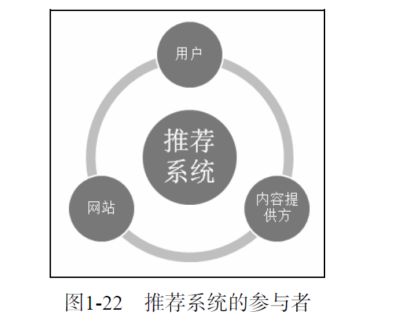

评测推荐系统指标包括准确度、覆盖度、新颖度、惊喜度、信任度、透明度。

### 1.3.1 推荐系统实验方法
在推荐系统中，主要有3种评测推荐效果的实验方法，即离线实验（offline experiment）、用户调查（user study）和在线实验（online experiment）。

1.离线实验
  - 通过日志系统获得用户行为数据，并按照一定格式生成一个标准的数据集；
  - 将数据集按照一定的规则分成训练集和测试集；
  - 在训练集上训练用户兴趣模型，在测试集上进行预测；
  - 通过事先定义的离线指标评测算法在测试集上的预测结果。

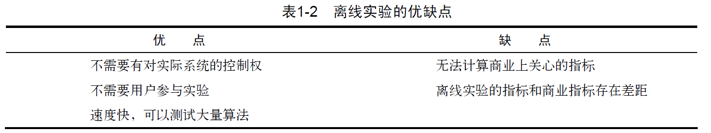

2.用户调查
  - 用户调查需要有一些真实用户，让他们在需要测试的推荐系统上完成一些任务。在他们完成任务时，我们需要观察和记录他们的行为，并让他们回答一些问题。最后，我们需要通过分析他们的行为和答案了解测试系统的性能。
  - 用户调查是推荐系统评测的一个重要工具，很多离线时没有办法评测的与用户主观感受有关的指标都可以通过用户调查获得。
  - 用户调查也有一些缺点: 首先，用户调查成本很高，需要用户花大量时间完成一个个任务，并回答相关的问题。我们在做用户调查时，一方面要控制成本，另一方面又要保证结果的统计意义。
  - 此外，测试用户也不是随便选择的。需要尽量保证测试用户的分布和真实用户的分布相同，比如男女各半，以及年龄、活跃度的分布都和真实用户分布尽量相同。
  - 用户调查要尽量保证是双盲实验，不要让实验人员和用户事先知道测试的目标，以免用户的回答和实验人员的测试受主观成分的影响。

3.在线实验
  - 在完成离线实验和必要的用户调查后，可以将推荐系统上线做AB测试，将它和旧的算法进行比较。
  - AB测试是一种很常用的在线评测算法的实验方法。 它通过一定的规则将用户随机分成几组，并对不同组的用户采用不同的算法，然后通过统计不同组用户的各种不同的评测指标比较不同算法，比如可以统计不同组用户的点击率，通过点击率比较不同算法的性能。
  - AB测试的优点是可以公平获得不同算法实际在线时的性能指标，包括商业上关注的指标。AB测试的缺点主要是周期比较长，必须进行长期的实验才能得到可靠的结果。其次，一个大型网站的AB测试系统的设计也是一项复杂的工程。
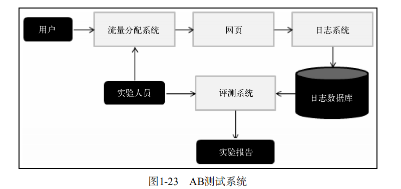

### 1.3.2 评测指标
  - 用户满意度: 用户满意度没有办法离线计算，只能通过用户调查或者在线实验获得。
  - 预测准确度: 预测准确度度量一个推荐系统或者推荐算法预测用户行为的能力。这个指标是最重要的推荐系统离线评测指标。在计算该指标时需要有一个离线的数据集，该数据集包含用户的历史行为记录。然后，将该数据集通过时间分成训练集和测试集。最后，通过在训练集上建立用户的行为和兴趣模型预测用户在测试集上的行为，并计算预测行为和测试集上实际行为的重合度作为预测准确度。
    - 评分预测的预测准确度一般通过均方根误差（RMSE）和平均绝对误差（MAE）计算。
    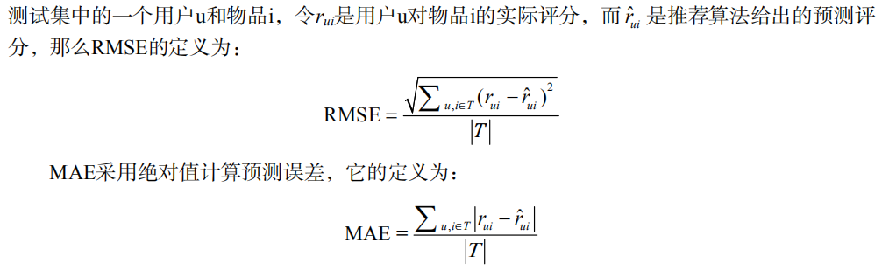 
    - TopN推荐: 个性化的推荐列表。TopN推荐的预测准确率一般通过准确率（precision）/召回率（recall）度量。
    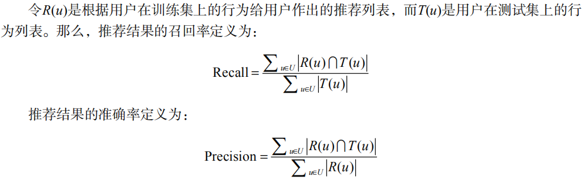 
  - 覆盖率: 描述一个推荐系统对物品长尾的发掘能力。最简单的定义为推荐系统能够推荐出来的物品占总物品集合的比例。覆盖率是一个内容提供商会关心的指标。
            马太效应，即所谓强者更强，弱者更弱的效应。如果一个系统会增大热门物品和非热门物品的流行度差距，让热门的物品更加热门，不热门的物品更加不热             门，那么这个系统就有马太效应。比如，首页的热门排行榜就有马太效应。
  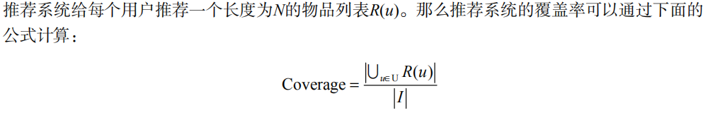 
  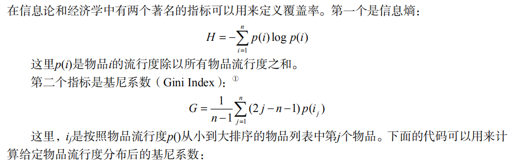 
  - 多样性： 多样性描述了推荐列表中物品两两之间的不相似性。因此，多样性和相似性是对应的。
  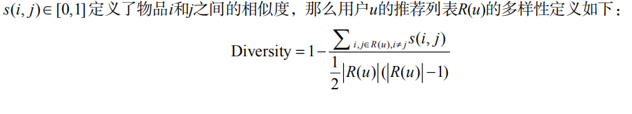 
  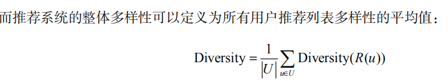 
  - 新颖性：新颖的推荐是指给用户推荐那些他们以前没有听说过的物品。评测新颖度的最简单方法是利用推荐结果的平均流行度，因为越不热门的物品越可能让用户觉得新颖。
  - 惊喜度：如果推荐结果和用户的历史兴趣不相似，但却让用户觉得满意，那么就可以说推荐结果的惊喜度很高，而推荐的新颖性仅仅取决于用户是否听说过这个
推荐结果。
  - 信任度： 如果用户信任推荐系统，那就会增加用户和推荐系统的交互。度量推荐系统的信任度只能通过问卷调查的方式，询问用户是否信任推荐系统的推荐结果。提高推荐系统的信任度主要有两种方法。首先需要增加推荐系统的透明度（transparency），而增加推荐系统透明度的主要办法是提供推荐解释。其次是考虑用户的社交网络信息，利用用户的好友信息给用户做推荐，并且用好友进行推荐解释。
  - 实时性： 因为物品（新闻、微博等）具有很强的时效性，所以需要在物品还具有时效性时就将它们推荐给用户。推荐系统的实时性包括两个方面。首先，推荐系统需要实时地更新推荐列表来满足用户新的行为变化。第二个方面是推荐系统需要能够将新加入系统的物品推荐给用户。
  - 健壮性： 健壮性（即robust,鲁棒性）指标衡量了一个推荐系统抗击作弊的能力。算法健壮性的评测主要利用模拟攻击。首先，给定一个数据集和一个算法，可以用这个算法给这个数据集中的用户生成推荐列表。然后，用常用的攻击方法向数据集中注入噪声数据，然后利用算法在注入噪声后的数据集上再次给用户生成推荐列表。最后，通过比较攻击前后推荐列表的相似度评测算法的健壮性。
  - 商业目标： 不同的网站具有不同的商业目标。比如电子商务网站的目标可能是销售额，基于展示广告盈利的网站其商业目标可能是广告展示总数，基于点击广告盈利的网站其商业目标可能是广告点击总数。
  - 总结对比：
  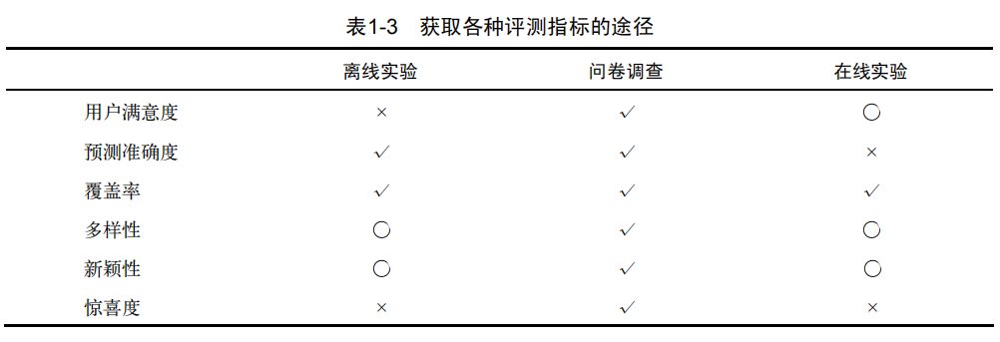 
  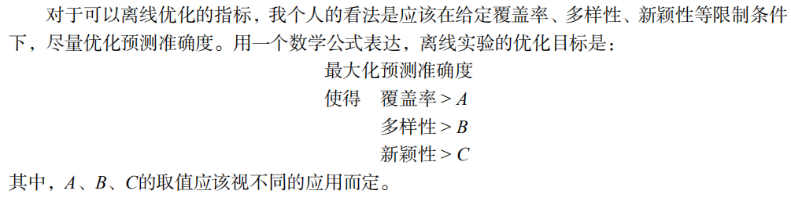 

### 1.3.3 评测维度
  - 用户维度： 主要包括用户的人口统计学信息、活跃度以及是不是新用户等。
  - 物品维度： 包括物品的属性信息、流行度、平均分以及是不是新加入的物品等。
  - 时间维度： 包括季节，是工作日还是周末，是白天还是晚上等。
