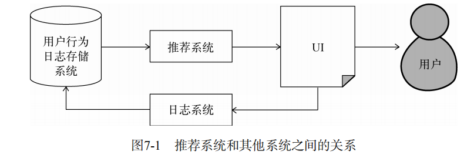
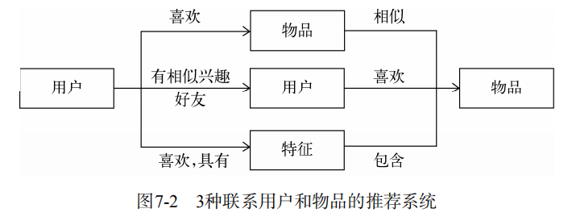
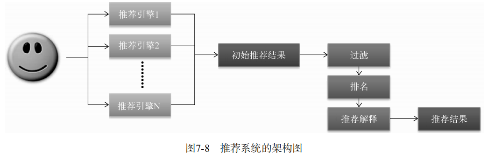
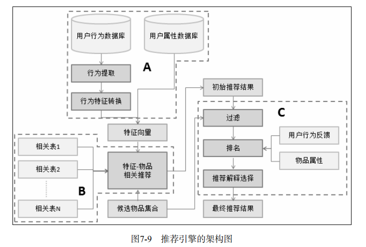
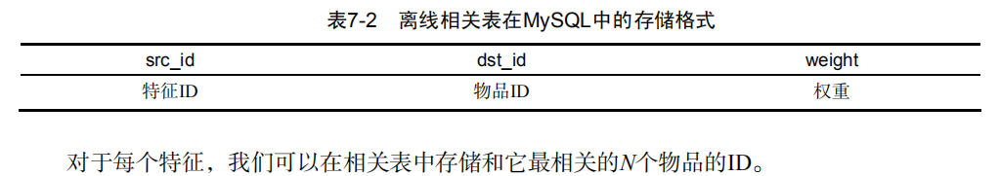

# 推荐系统实例

## 7.1 外围架构

  - 推荐系统外围架构：
  
  
  - 推荐系统界面共性：
    - 通过一定方式展示物品，主要包括物品的标题、缩略图和介绍等。
    - 很多推荐界面都提供了推荐理由，理由可以增加用户对推荐结果的信任度。
    - 推荐界面还需要提供一些按钮让用户对推荐结果进行反馈，这样才能让推荐算法不断改善用户的个性化推荐体验。
    
  - 数据收集和存储
    - 按照数据的规模和是否需要实时存取，不同的行为数据将被存储在不同的媒介中。
    - 一般来说，需要实时存取的数据存储在数据库和缓存中，而大规模的非实时地存取数据存储在分布式文件系统（如HDFS）中。
    
## 7.2 推荐系统架构

  - 用户和物品联系方式：
  
  
  - 基于特征的推荐系统架构拆解成两部分，一个是如何为给定用户生成特征，另一个是如何根据特征找到物品。
  
  - 用户的特征种类：
    - 人口统计学特征：包括用户的年龄、性别、国籍和民族等用户在注册时提供的信息。
    - 用户的行为特征：包括用户浏览过什么物品、收藏过什么物品、给什么物品打过什么样的分数等用户行为相关的特征。同时，用户行为从时间上也可以分为用户近期的行为和长期的行为。
    - 用户的话题特征：可以根据用户的历史行为利用话题模型（topic model）将电视剧和电影聚合成不同的话题，并且计算出每个用户对什么话题感兴趣。
    
  - 推荐系统的推荐任务：
    - 将最新加入的物品推荐给用户。
    - 将商业上需要宣传的物品推荐给用户。
    - 给用户推荐不同种类的物品。
    - 给用户混合推荐，有时需要将图书和音像制品放到一个推荐列表中展示给用户。
    - 推荐不同新颖度的物品。
    - 考虑到用户访问推荐系统的上下文。
    
  - 推荐系统需要由多个推荐引擎组成，每个推荐引擎负责一类特征和一种任务，而推荐系统的任务只是将推荐引擎的结果按照一定权重或者优先级合并、排序然后返回。 
  
  
  - 以上推荐系统架构的优点：
    - 可以方便地增加/删除引擎，控制不同引擎对推荐结果的影响。
    - 可以实现推荐引擎级别的用户反馈。每一个推荐引擎其实代表了一种推荐策略，而不同的用户可能喜欢不同的推荐策略。通过分析用户对推荐结果的反馈了解用户比较喜欢哪些引擎推荐出来的结果，从而对不同的用户给出不同的引擎组合权重。
    
## 7.3 推荐引擎的架构

  - 推荐引擎的架构图
  
  
### 7.3.1 生成用户特征向量

  - 用户的特征包括两种，一种是用户的注册信息中可以提取出来的，主要包括用户的人口统计学特征。另一种特征主要是从用户的行为中计算出来的。
  - 利用用户行为计算特征向量时需要考虑以下因素：
    - 用户行为的种类
    - 用户行为产生的时间
    - 用户行为的次数
    - 物品的热门程度
    
### 7.3.2 特征—物品相关推荐

  - 离线相关表：
  
  
  - 特征—物品相关推荐模块除了给用户返回物品推荐列表，还需要给推荐列表中的每个推荐结果产生一个解释列表，表明这个物品是因为哪些特征推荐出来的。
  
### 7.3.3 过滤模块

  - 在得到初步的推荐列表后，还不能把这个列表展现给用户，首先需要按照产品需求对结果进行过滤，过滤掉那些不符合要求的物品。
  - 一般来说，过滤模块会过滤掉以下物品：
    - 用户已经产生过行为物品
    - 候选物品以外的物品
    - 某些质量很差的物品：绝大多数用户评论都很差的物品
    
### 7.3.4 排名模块

  - 新颖性排名：给用户尽量推荐他们不知道的、长尾中的物品。
  - 多样性：增加多样性可以让推荐结果覆盖尽可能多的用户兴趣。
    - 第一种提高多样性的方法是将推荐结果按照某种物品的内容属性分成几类，然后在每个类中都选择该类中排名最高的物品组合成最终的推荐列表。
    - 第二种提高推荐结果多样性的方法是控制不同推荐结果的推荐理由出现的次数。
  - 时间多样性：时间多样性主要是为了保证用户不要每天来推荐系统都看到同样的推荐结果。
    - 首先要保证推荐系统的实时性，在用户有新行为时实时调整推荐结果以满足用户最近的需求。
    - 要在用户没有新的行为时，也要保证推荐结果每天都有变化。
  - 用户反馈：用户反馈模块主要通过分析用户之前和推荐结果的交互日志，预测用户会对什么样的推荐结果比较感兴趣。
  

  
