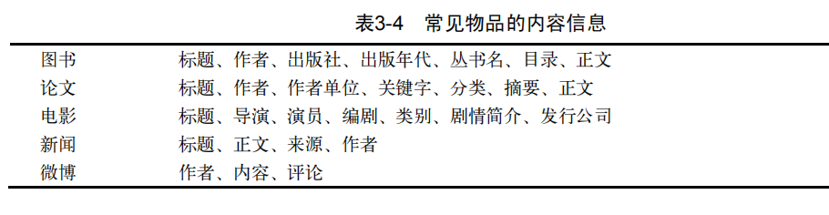

# 推荐系统冷启动问题 

## 3.1 冷启动问题简介

  - 冷启动问题分类：
    - 用户冷启动: 用户冷启动主要解决如何给新用户做个性化推荐的问题。当新用户到来时，我们没有他的行为数据，所以也无法根据他的历史行为预测其兴趣，从而无法借此给他做个性化推荐。
    - 物品冷启动: 物品冷启动主要解决如何将新的物品推荐给可能对它感兴趣的用户这一问题。
    - 系统冷启动: 系统冷启动主要解决如何在一个新开发的网站上（还没有用户，也没有用户行为，只有一些物品的信息）设计个性化推荐系统，从而在网站刚发布时就让用户体验到个性化推荐服务这一问题。
  
  - 一般的解决方案：
    - 提供非个性化的推荐，可以给用户推荐热门排行榜，然后等到用户数据收集到一定的时候，再切换为个性化推荐。
    - 利用用户注册时提供的年龄、性别等数据做粗粒度的个性化。
    - 利用用户的社交网络账号登录（需要用户授权），导入用户在社交网站上的好友信息，然后给用户推荐其好友喜欢的物品。
    - 要求用户在登录时对一些物品进行反馈，收集用户对这些物品的兴趣信息，然后给用户推荐那些和这些物品相似的物品。
    - 对于新加入的物品，可以利用内容信息，将它们推荐给喜欢过和它们相似的物品的用户。
    - 在系统冷启动时，可以引入专家的知识，通过一定的高效方式迅速建立起物品的相关度表。
 
 ## 3.2 利用用户注册信息
 
  - 用户的注册信息分3种：
    - 人口统计学信息：包括用户的年龄、性别、职业、民族、学历和居住地。
    - 用户兴趣的描述：有一些网站会让用户用文字描述他们的兴趣。
    - 从其他网站导入的用户站外行为数据：比如用户通过豆瓣、新浪微博的账号登录，就可以在得到用户同意的情况下获取用户在豆瓣或者新浪微博的一些行为数据和社交网络数据。
  - 基于注册信息的个性化推荐流程基本如下：
    - (1) 获取用户的注册信息；
    - (2) 根据用户的注册信息对用户分类；
    - (3) 给用户推荐他所属分类中用户喜欢的物品。

## 3.3 选择合适的物品启动用户的兴趣

  - 解决用户冷启动问题的另一个方法是在新用户第一次访问推荐系统时，不立即给用户展示推荐结果，而是给用户提供一些物品，让用户反馈他们对这些物品的兴趣，然后根据用户反馈给提供个性化推荐。
  - 对于这些通过让用户对物品进行评分来收集用户兴趣，从而对用户进行冷启动的系统，它们需要解决的首要问题就是如何选择物品让用户进行反馈。能够用来启动用户兴趣的物品需要具有以下特点：
    - 比较热门
    - 具有代表性和区分性
    - 启动物品集合需要有多样性
 
## 3.4 利用物品的内容信息

  - 物品冷启动需要解决的问题是如何将新加入的物品推荐给对它感兴趣的用户。
  - 常见物品的内容信息：
    
  - 一般来说，物品的内容可以通过向量空间模型表示，该模型会将物品表示成一个关键词向量。对于中文，首先要对文本进行分词，将字流变成词流，然后从词流中
检测出命名实体（如人名、地名、组织名等），这些实体和一些其他重要的词将组成关键词集合，最后对关键词进行排名，计算每个关键词的权重，从而生成关键词向量。
    
    
## 3.5 发挥专家的作用

  - 很多推荐系统在建立时，既没有用户的行为数据，也没有充足的物品内容信息来计算准确的物品相似度。那么，为了在推荐系统建立时就让用户得到比较好的体验，很多系统都利用专家进行标注。这方面的代表系统是个性化网络电台Pandora和电影推荐网站Jinni。
