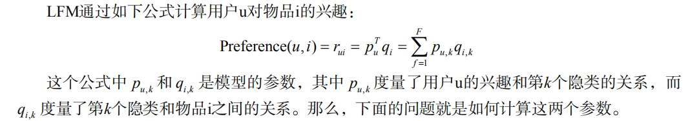
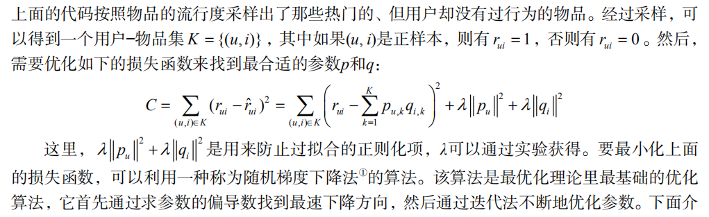
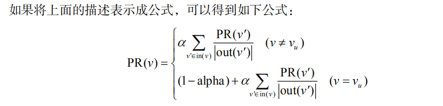

# 利用用户行为数据

基于用户行为分析的推荐算法是个性化推荐系统的重要算法，学术界一般将这种类型的算法称为协同过滤算法。

## 2.1 用户行为数据

  - 用户行为数据在网站上最简单的存在形式就是日志。网站在运行过程中都产生大量原始日志（raw log），并将其存储在文件系统中。很多互联网业务会把多种原始日志按照用户行为汇总成会话日志（session log），其中每个 会话表示一次用户行为和对应的服务。这些日志记录了用户的各种行为，如在电子商务网站中这些行为主要包括网页浏览、购买、点击、评分和评论等。
  - 用户行为在个性化推荐系统中一般分两种——显性反馈行为（explicit feedback）和隐性反馈行为（implicit feedback）。显性反馈行为包括用户明确表示对物品喜好的行为。这里的主要方式就是评分和喜欢/不喜欢。隐性反馈行为指的是那些不能明确反应用户喜好的行为。最具代表性的隐性反馈行为就是页面浏览行为。
  
  

  - 按照反馈的明确性分，用户行为数据可以分为显性反馈和隐性反馈，但按照反馈的方向分，又可以分为正反馈和负反馈。正反馈指用户的行为倾向于指用户喜欢该物品，而负反馈指用户的行为倾向于指用户不喜欢该物品。
  
  
  
  - 用户行为的表示：
  
  
  
  - 代表性的数据集:
    - 无上下文信息的隐性反馈数据集： 每一条行为记录仅仅包含用户ID和物品ID。（Book-Crossing）
    - 无上下文信息的显性反馈数据集： 每一条记录包含用户ID、物品ID和用户对物品的评分。
    - 有上下文信息的隐性反馈数据集： 每一条记录包含用户ID、物品ID和用户对物品产生行为的时间戳。（Lastfm）
    - 有上下文信息的显性反馈数据集： 每一条记录包含用户ID、物品ID、用户对物品的评分和评分行为发生的时间戳。（Netflix Prize）
    
## 2.2 用户行为分析

### 2.2.1 用户活跃度和物品流行度的分布

  - 长尾分布：
  
  
 
### 2.2.2 用户活跃度和物品流行度的关系

  - 一般认为，新用户倾向于浏览热门的物品，因为他们对网站还不熟悉，只能点击首页的热门物品，而老用户会逐渐开始浏览冷门的物品。用户越活跃，越倾向于浏览冷门的物品。
  - 仅仅基于用户行为数据设计的推荐算法一般称为协同过滤算法。 包括： 基于邻域的方法（neighborhood-based）、隐语义模型（latent factor model）、基于图的随机游走算法（random walk on graph）等。
  - 基于邻域的方法：
    - 基于用户的协同过滤算法： 这种算法给用户推荐和他兴趣相似的其他用户喜欢的物品。
    - 基于物品的协同过滤算法： 这种算法给用户推荐和他之前喜欢的物品相似的物品。

## 2.3 实验设计和算法评测

### 2.3.1 数据集

  - MovieLens数据集：该数据集包含6000多用户对4000多部电影的100万条评分。该数据集是一个评分数据集，用户可以给电影评5个不同等级的分数（1～5分）。本章着重研究隐反馈数据集中的TopN推荐问题，因此忽略了数据集中的评分记录。
  
### 2.3.2 实验设计

  - 协同过滤算法的离线实验设计： 首先，将用户行为数据集按照均匀分布随机分成M份（本章取M=8），挑选一份作为测试集，将剩下的M-1份作为训练集。然后在训练集上建立用户兴趣模型，并在测试集上对用户行为进行预测，统计出相应的评测指标。为了保证评测指标并不是过拟合的结果，需要进行M次实验，并且每次都使用不同的测试集。然后将M次实验测出的评测指标的平均值作为最终的评测指标。

### 2.3.3 评测指标

  - 准确率
  - 召回率
  - 覆盖率
  - 新颖度

## 2.4 基于邻域的算法

基于邻域的算法分为两大类，一类是基于用户的协同过滤算法，另一类是基于物品的协同过滤算法。

### 2.4.1 基于用户的协同过滤算法

  - 基于用户的协同过滤算法主要包括两个步骤：
    - （1）找到和目标用户兴趣相似的用户集合。
    - （2）找到这个集合中的用户喜欢的，且目标用户没有听说过的物品推荐给目标用户。
  - 步骤(1)的关键就是计算两个用户的兴趣相似度。
  
  
  
  
  
  - 用户相似度计算的改进:
  

### 2.4.2 基于物品的协同过滤算法

  - ItemCF算法并不利用物品的内容属性计算物品之间的相似度，它主要通过分析用户的行为记录计算物品之间的相似度。该算法认为，物品A和物品B具有很大的相似度是因为喜欢物品A的用户大都也喜欢物品B。
  - 基于物品的协同过滤算法主要分为两步:
    - (1) 计算物品之间的相似度。
    - (2) 根据物品的相似度和用户的历史行为给用户生成推荐列表。
  - 物品相似度：
    
  
    
  - ItemCF:
    
  - ItemCF-IUF:
    
  - 物品相似度的归一化:
    
  
### 2.4.3 UserCF和ItemCF的综合比较

  - UserCF给用户推荐那些和他有共同兴趣爱好的用户喜欢的物品，而ItemCF给用户推荐那些和他之前喜欢的物品类似的物品。
  - UserCF的推荐结果着重于反映和用户兴趣相似的小群体的热点，而ItemCF的推荐结果着重于维系用户的历史兴趣。 UserCF的推荐更社会化，反映了用户所在的小型兴趣群体中物品的热门程度，而ItemCF的推荐更加个性化，反映了用户自己的兴趣传承。
  - 从技术上考虑，UserCF需要维护一个用户相似度的矩阵，而ItemCF需要维护一个物品相似度矩阵。从存储的角度说，如果用户很多，那么维护用户兴趣相似度矩阵需要很大的空间，同理，如果物品很多，那么维护物品相似度矩阵代价较大。
  - UserCF和ItemCF比较：
    
  - 首先要指出的是，离线实验的性能在选择推荐算法时并不起决定作用。首先应该满足产品的需求，比如如果需要提供推荐解释，那么可能得选择ItemCF算法。其次，需要看实现代价，比如若用户太多，很难计算用户相似度矩阵，这个时候可能不得不抛弃UserCF算法。最后，离线指标和点击率等在线指标不一定成正比。
  - 两个不同领域的最热门物品之间往往具有比较高的相似度。 仅仅靠用户行为数据是不能解决这个问题的，我们只能依靠引入物品的内容数据解决这个问题，比如对不同领域的物品降低权重等。

## 隐语义模型

### 2.5.1 基础算法

  - 隐语义模型(LFM)公式：
  
  - 负样本采样时应该遵循以下原则:
    - 对每个用户，要保证正负样本的平衡（数目相似）。
    - 对每个用户采样负样本时，要选取那些很热门，而用户却没有行为的物品。
  - LFM损失函数：
  
 
 ### 2.5.3 LFM和基于邻域的方法的比较
 
 - 理论基础： LFM具有比较好的理论基础，它是一种学习方法，通过优化一个设定的指标建立最优的模型。基于邻域的方法更多的是一种基于统计的方法，并没有学习过程。
 - 离线计算的空间复杂度： 基于邻域的方法需要维护一张离线的相关表。在离线计算相关表的过程中，如果用户/物品数很多，将会占据很大的内存。 假设是用户相关表，则需要O(M*M)的空间，而对于物品相关表，则需要O(N*N)的空间。而LFM在建模过程中，如果是F个隐类，那么它需要的存储空间是O(F*(M+N))，这在M和N很大时可以很好地节省离线计算的内存。
 - 离线计算的时间复杂度： 假设有M个用户、N个物品、K条用户对物品的行为记录。那么，UserCF计算用户相关表的时间复杂度是O(N * (K/N)^2)，而ItemCF计算物品相关表的时间复杂度是O(M*(K/M)^2)。而对于LFM，如果用F个隐类，迭代S次，那么它的计算复杂度是O(K * F * S)。 在一般情况下，LFM的时间复杂度要稍微高于UserCF和ItemCF，这主要是因为该算法需要多次迭代。
 - 在线实时推荐： UserCF和ItemCF在线服务算法需要将相关表缓存在内存中，然后可以在线进行实时的预测。 LFM在生成一个用户推荐列表时速度太慢，因此不能在线实时计算，而需要离线将所有用户的推荐结果事先计算好存储在数据库中。
 - 推荐解释： ItemCF算法支持很好的推荐解释，它可以利用用户的历史行为解释推荐结果。 但LFM无法提供这样的解释，它计算出的隐类虽然在语义上确实代表了一类兴趣和物品，却很难用自然语言描述并生成解释展现给用户。

## 2.6 基于图的模型

### 2.6.1 用户行为数据的二分图表示

### 2.6.2 基于图的推荐算法

  - 图中顶点的相关性主要取决于下面3个因素：
    - 两个顶点之间的路径数；
    - 两个顶点之间路径的长度；
    - 两个顶点之间的路径经过的顶点。
  - 相关性高的一对顶点一般具有如下特征：
    - 两个顶点之间有很多路径相连；
    - 连接两个顶点之间的路径长度都比较短；
    - 连接两个顶点之间的路径不会经过出度比较大的顶点。
  - 基于随机游走的PersonalRank算法: 假设要给用户u进行个性化推荐，可以从用户u对应的节点vu开始在用户物品二分图上进行随机游走。 游走到任何一个节点时，首先按照概率α决定是继续游走，还是停止这次游走并从vu节点开始重新游走。如果决定继续游走，那么就从当前节点指向的节点中按照均匀分布随机选择一个节点作为游走下次经过的节点。这样，经过很多次随机游走后，每个物品节点被访问到的概率会收敛到一个数。最终的推荐列表中物品的权重就是物品节点的访问概率。

