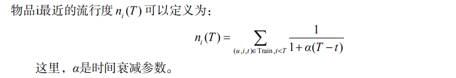
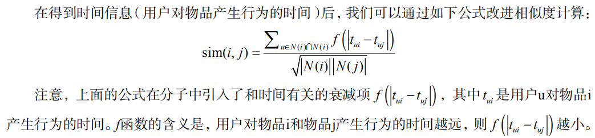
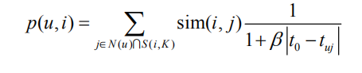
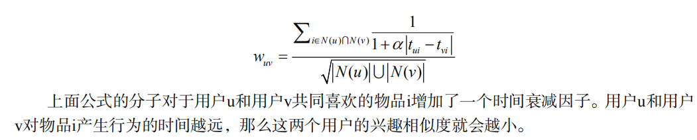
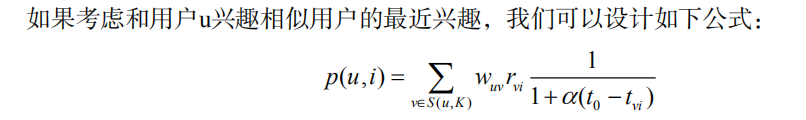

# 利用上下文信息

  - 上下文信息包括用户访问推荐系统的时间、地点、心情等。
  
## 5.1 时间上下文信息

### 5.1.1 时间效应简介

  - 时间信息对用户兴趣的影响表现在以下几个方面：
    - 用户兴趣是变化的： 如果我们要准确预测用户现在的兴趣，就应该关注用户最近的行为，因为用户最近的行为最能体现他现在的兴趣。
    - 物品也是有生命周期的： 不同系统的物品具有不同的生命周期，比如新闻的生命周期很短暂，而电影的生命周期相对较长。
    - 季节效应：季节效应主要反映了时间本身对用户兴趣的影响。比如人们夏天吃冰淇淋，冬天吃火锅。
    
 ### 5.1.3 系统时间特性的分析
 
  - 系统的时间特性信息：
    - 数据集每天独立用户数的增长情况
    - 系统的物品变化情况
    - 用户访问情况
    
 ### 5.1.4 推荐系统的实时性
 
  - 一个实时的推荐系统需要能够实时响应用户新的行为，让推荐列表不断变化，从而满足用户不断变化的兴趣。
  - 实现推荐系统的实时性除了对用户行为的存取有实时性要求，还要求推荐算法本身具有实时性，而推荐算法本身的实时性意味着：
    - 实时推荐系统不能每天都给所有用户离线计算推荐结果，然后在线展示昨天计算出来的结果。所以，要求在每个用户访问推荐系统时，都根据用户这个时间点前的行为实时计算推荐列表。
    - 推荐算法需要平衡考虑用户的近期行为和长期行为，即要让推荐列表反应出用户近期行为所体现的兴趣变化，又不能让推荐列表完全受用户近期行为的影响，要保证推荐列表对用户兴趣预测的延续性。

### 5.1.5 推荐算法的时间多样性

  - 推荐系统每天推荐结果的变化程度被定义为推荐系统的时间多样性。时间多样性高的推荐系统中用户会经常看到不同的推荐结果。
  - 提高推荐结果的时间多样性需要分两步解决：
    - 首先，需要保证推荐系统能够在用户有了新的行为后及时调整推荐结果，使推荐结果满足用户最近的兴趣；
    - 其次，需要保证推荐系统在用户没有新的行为时也能够经常变化一下结果，具有一定的时间多样性。
    
### 5.1.6 时间上下文推荐算法

  - 最近最热门
    - 在没有时间信息的数据集中，我们可以给用户推荐历史上最热门的物品。那么在获得用户行为的时间信息后，最简单的非个性化推荐算法就是给用户推荐最近最热门的物品了。
    - 物品i最近的流行度：
    
  - 时间上下文相关的ItemCF算法
    - 物品相似度：用户在相隔很短的时间内喜欢的物品具有更高相似度。
    - 在线推荐：用户近期行为相比用户很久之前的行为，更能体现用户现在的兴趣。因此在预测用户现在的兴趣时，应该加重用户近期行为的权重，优先给用户推荐那些和他近期喜欢的物品相似的物品。
    - 得到时间信息（用户对物品产生行为的时间）后，可以通过如下公式改进相似度计算：
    
    - 考虑时间信息对预测公式的影响，可以通过如下方式修正预测公式：
    
  - 时间上下文相关的UserCF算法
    - 用户兴趣相似度
    - 相似兴趣用户的最近行为：给用户推荐和他兴趣相似的用户最近喜欢的物品。
    - 改进相似度计算：
    
    - 修正预测公式：
    
    
## 5.2 地点上下文信息

  - 地点作为一种重要的空间特征，也是一种重要的上下文信息。不同地区的用户兴趣有所不同，用户到了不同的地方，兴趣也会有所不同。
  - 用户兴趣和地点相关的两种特征：
    - 兴趣本地化：不同地方的用户兴趣存在着很大的差别。不同国家和地区用户的兴趣存在着一定的差异性。
    - 活动本地化：一个用户往往在附近的地区活动。在基于位置的推荐中我们需要考虑推荐地点和用户当前地点的距离，不能给用户推荐太远的地方。
