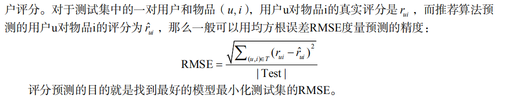
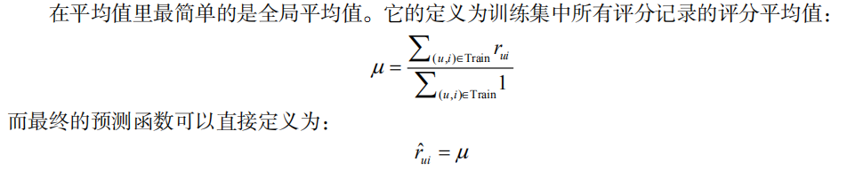
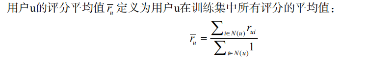
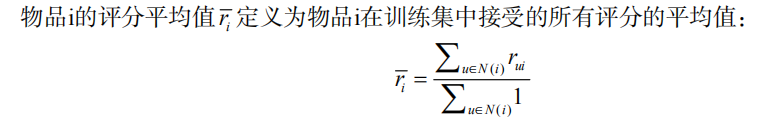
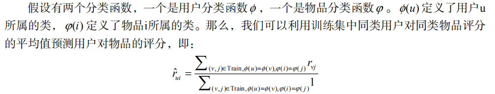
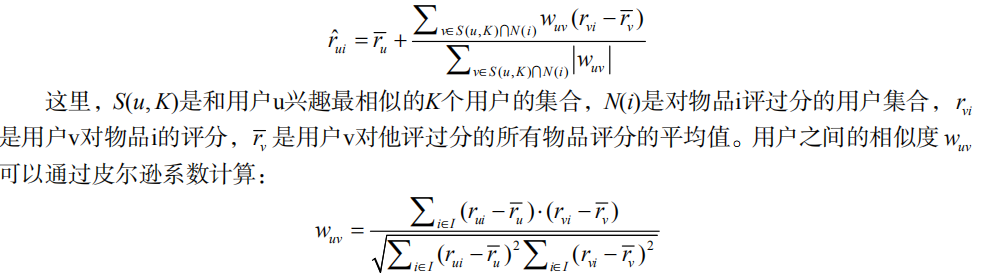
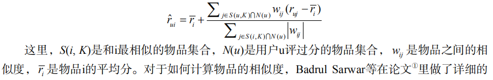
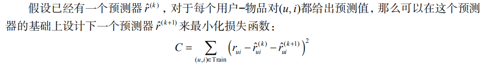

# 评分预测问题

  - 评分预测问题最基本的数据集就是用户评分数据集。该数据集由用户评分记录组成，每一条评分记录是一个三元组(u, i, r)，表示用户u给物品i赋予了评分r。
  
## 8.1 离线实验方法

  - 评测方法：
  
  
## 8.2 评分预测算法

### 8.2.1 平均值

  - 全局平均值
  
  
  - 用户评分平均值
  
  
  - 物品评分平均值
  
  
  - 用户分类对物品分类的平均值
  
  
## 8.2.2 基于邻域的方法

  - 基于用户的邻域算法认为预测一个用户对一个物品的评分，需要参考和这个用户兴趣相似的用户对该物品的评分。
  
  
  - 基于物品的邻域算法在预测用户u对物品i的评分时，会参考用户u对和物品i相似的其他物品的评分。
  
  
### 8.2.3 隐语义模型与矩阵分解模型

  - 传统的SVD分解
  - Simon Funk的SVD分解
  - 加入偏置项后的LFM
  - 考虑邻域影响的LFM
  
### 8.2.4 加入时间信息

  - 利用时间信息的方法也主要分成两种，一种是将时间信息应用到基于邻域的模型中，另一种是将时间信息应用到矩阵分解模型中。
    - 基于邻域的模型融合时间信息
    - 基于矩阵分解的模型融合时间信息
    
### 8.2.5 模型融合

  - 模型级联融合
  
  
  - 模型加权融合
    - 假设数据集已经被分为了训练集A和测试集B，那么首先需要将训练集A按照相同的分割方法分为A1和A2，其中A2的生成方法和B的生成方法一致，且大小相似。
    - 在A1上训练K个不同的预测器，在A2上作出预测。因为我们知道A2上的真实评分值，所以可以在A2上利用最小二乘法计算出线性融合系数。
    - 在A上训练K个不同的预测器，在B上作出预测，并且将这K个预测器在B上的预测结果按照已经得到的线性融合系数加权融合，以得到最终的预测结果。
  
