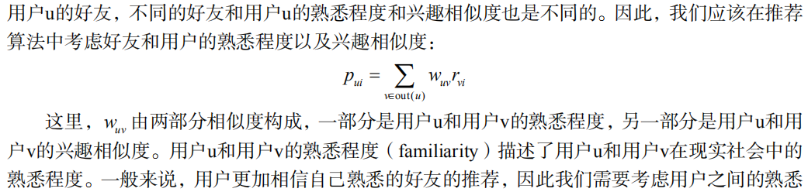
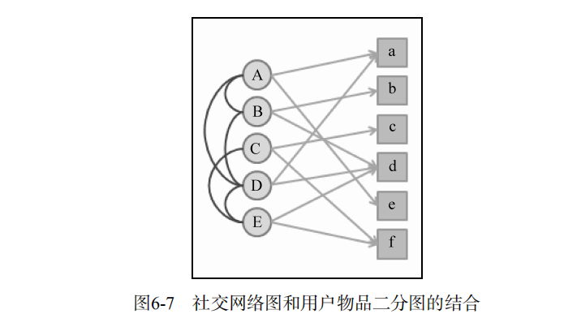
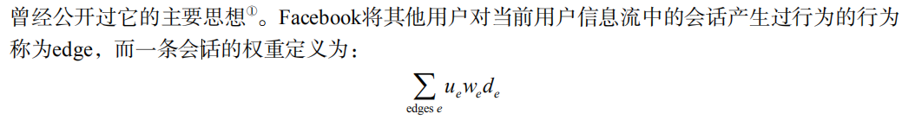

# 利用社交网络数据

## 6.1 获取社交网络数据的途径

  - 电子邮件：正是由于电子邮件系统包含了用户的大量社交信息，很多社交网站都在用户注册时提供了让用户从电子邮件联系人中导入好友关系的功能，用以解决社交网络的冷起动问题。
  - 用户注册信息
  - 用户的位置数据：在网页上最容易拿到的用户位置信息就是IP地址。对于手机等移动设备，我们可以拿到更详细的GPS数据。
  - 论坛和讨论组
  - 即时聊天工具：和电子邮件系统一样，用户在即时聊天工具上也会有一个联系人列表，而且往往还会给联系人进行分组。通过这个列表和分组信息，我们就可以知道用户的社交网络关系，而通过统计用户
之间聊天的频繁程度，可以度量出用户之间的熟悉程度。
  - 社交网站：Facebook和Twitter作为社交网站中的两个代表，它们其实代表了不同的社交网络结构。在Facebook里，人们的好友一般都是自己在现实社会中认识的人，比如亲戚、同学、同事等，
  而且Facebook中的好友关系是需要双方确认的。在Twitter里，人们的好友往往都是现实中自己不认识的，而只是出于对对方言论的兴趣而建立好友关系，好友关系也是单向的关注关系。
  Facebook为代表的社交网络称为社交图谱（social graph），而以Twitter为代表的社交网络称为兴趣图谱（interest graph）。
  
## 6.2 社交网络数据简介

  - 一般来说，有3种不同的社交网络数据：
    - 双向确认的社交网络数据：用户A和B之间形成好友关系需要通过双方的确认。因此，这种社交网络一般可以通过无向图表示。
    - 单向关注的社交网络数据：用户A可以关注用户B而不需要得到用户B的允许，因此这种社交网络中的用户关系是单向的，可以通过有向图表示。
    - 基于社区的社交网络数据：用户之间并没有明确的关系，但是这种数据包含了用户属于不同社区的数据。属于同一个小组可能代表了用户兴趣的相似性。
    
## 6.3 基于社交网络的推荐

  - 社会化推荐优点：
    - 好友推荐可以增加推荐的信任度
    - 社交网络可以解决冷启动问题
  - 社会化推荐缺点：
    - 并不一定能提高推荐算法的离线精度（准确率和召回率）。特别是在基于社交图谱数据的推荐系统中，因为用户的好友关系不是基于共同兴趣产生的，所以用户好友的兴趣往往和用户的兴趣并不一致。

### 6.3.1 基于邻域的社会化推荐算法

  - 如果给定一个社交网络和一份用户行为数据集。其中社交网络定义了用户之间的好友关系，而用户行为数据集定义了不同用户的历史行为和兴趣数据。
  - 考虑好友和用户的熟悉程度以及兴趣相似度：
  
  
### 6.3.2 基于图的社会化推荐算法

  - 社交网络图模型：
  
  
  
### 6.3.3 实际系统中的社会化推荐算法
  
  - 基于邻域的社会化推荐算法看起来非常简单，但在实际系统中却是很难操作的，这主要是因为该算法需要拿到用户所有好友的历史行为数据，而这一操作在实际系统中是比较重的操作。
  - 提升响应时间的改进方法：
    - 一种是治标不治本的方法就是可以做两处截断。第一处截断就是在拿用户好友集合时并不拿出用户所有的好友，而是只拿出和用户相似度最高的N个好友。此外，
在查询每个用户的历史行为时，可以只返回用户最近1个月的行为，这样就可以在用户行为缓存中缓存更多用户的历史行为数据，从而加快查询用户历史行为接口的速度。
    - 第二种解决方案需要重新设计数据库。首先，为每个用户维护一个消息队列，用于存储他的推荐列表；当一个用户喜欢一个物品时，就将（物品ID、用户ID和时间）这条记录写入关注该用户的推荐列表消息队列中；当用户访问推荐系统时，读出他的推荐列表消息队列，对于这个消息队列中的每个物品，重新计算该物品的权重。计算权重时需要考虑物品在队列中出现的次数，物品对应的用户和当前用户的熟悉程度、物品的时间戳。同时，计算出每个物品被哪些好友喜欢过，用这些好友作为物品的推荐解释。

### 6.3.4 社会化推荐系统和协同过滤推荐系统

  - 社会化推荐系统的效果往往很难通过离线实验评测，因为社会化推荐的优势不在于增加预测准确度，而是在于通过用户的好友增加用户对推荐结果的信任度，从而让用户单击那些很冷门的推荐结果。
  
### 6.3.5 信息流推荐

  - 信息流推荐是社会化推荐领域的新兴话题，它主要针对Twitter和Facebook这两种社交网站。在这两种社交网站中，每个用户都有一个信息墙，展示了用户好友最近
的言论。信息流的个性化推荐要解决的问题就是如何进一步帮助用户从信息墙上挑选有用的信息。
  - 目前最流行的信息流推荐算法是Facebook的EdgeRank，该算法综合考虑了信息流中每个会话的时间、长度与用户兴趣的相似度。
  - EdgeRank主要思想：
  
    - ue指产生行为的用户和当前用户的相似度，这里的相似度主要是在社交网络图中的熟悉度；
    - we 指行为的权重，这里的行为包括创建、评论、like（喜欢）、打标签等，不同的行为有不同的权重。
    - de指时间衰减参数，越早的行为对权重的影响越低。
  - EdgeRank算法的个性化因素仅仅是好友的熟悉度，它并没有考虑帖子内容和用户兴趣的相似度。
  
## 6.4 给用户推荐好友

  - 好友推荐系统的目的是根据用户现有的好友、用户的行为记录给用户推荐新的好友，从而增加整个社交网络的稠密程度和社交网站用户的活跃度。
  
### 6.4.1 基于内容的匹配

  - 我们可以给用户推荐和他们有相似内容属性的用户作为好友，常用的内容属性包括：
    - 用户人口统计学属性，包括年龄、性别、职业、毕业学校和工作单位等。
    - 用户的兴趣，包括用户喜欢的物品和发布过的言论等。
    - 用户的位置信息，包括用户的住址、IP地址和邮编等。
  
### 6.4.2 基于共同兴趣的好友推荐

  - 基于用户的协同过滤算法（UserCF）时已经详细介绍了如何计算用户之间的兴趣相似度，其主要思想就是如果用户喜欢相同的物品，则说明他们具有相似的兴趣。
  - 也可以根据用户在社交网络中的发言提取用户的兴趣标签，来计算用户的兴趣相似度。
  
### 6.4.3 基于社交网络图的好友推荐

  - 最简单的好友推荐算法是给用户推荐好友的好友。基于好友的好友推荐算法可以用来给用户推荐他们在现实社会中互相熟悉，而在当前社交网络中没有联系的其他用户。
