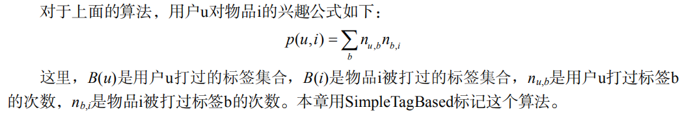
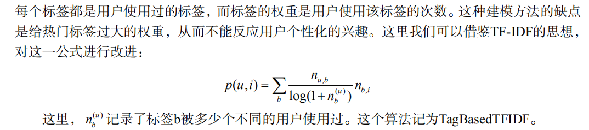
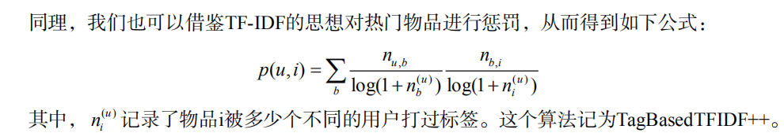
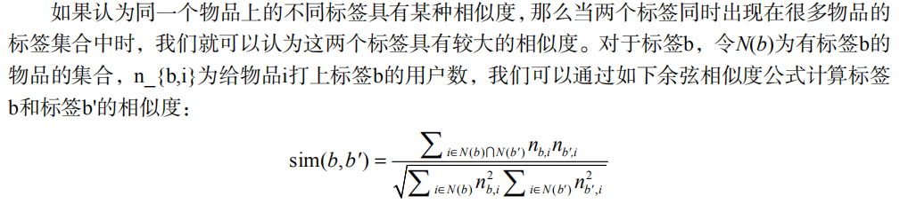
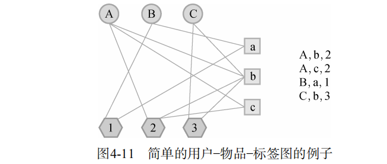
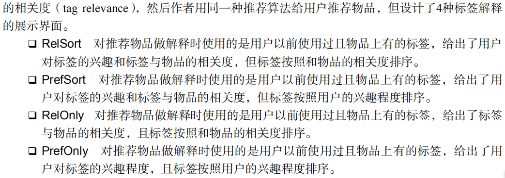

# 利用用户标签数据

  - 根据给物品打标签的人的不同，标签应用一般分为两种：一种是让作者或者专家给物品打标签；另一种是让普通用户给物品打标签，也就是UGC（User Generated Content，用户生成的内容）的标签应用。
  - UGC的标签系统是一种表示用户兴趣和物品语义的重要方式。当一个用户对一个物品打上一个标签，这个标签一方面描述了用户的兴趣，另一方面则表示了物品的语义，从而将用户和物品联系了起来。
  
## 4.1 UGC 标签系统的代表应用

  - UGC标签系统是很多Web 2.0网站的必要组成部分，UGC标签系统的鼻祖Delicious、论文书签网站CiteULike、音乐网站Last.fm、视频网站Hulu、书和电影评论网站豆瓣等。
  
## 4.2 标签系统中的推荐问题

  - 标签系统中的推荐问题主要有以下两个：
    - 如何利用用户打标签的行为为其推荐物品（基于标签的推荐）？
    - 如何在用户给物品打标签时为其推荐适合该物品的标签（标签推荐）？
  - 为了研究上面的两个问题，我们首先需要解答下面3个问题：
    - 用户为什么要打标签？
    - 用户怎么打标签？
    - 用户打什么样的标签？

### 4.2.1 用户为什么进行标注

  - 社会维度：有些用户标注是给内容上传者使用的（便于上传者组织自己的信息），而有些用户标注是给广大用户使用的（便于帮助其他用户找到信息）。
  - 功能维度：有些标注用于更好地组织内容，方便用户将来的查找，而另一些标注用于传达某种信息，比如照片的拍摄时间和地点等。

### 4.2.2 用户如何打标签

  - 标签的流行度分布也呈现非常典型的长尾分布，它的双对数曲线几乎是一条直线。
  
### 4.2.3 用户打什么样的标签

  - 标签的分类：
    - 表明物品是什么
    - 表明物品的种类
    - 表明谁拥有物品
    - 表达用户的观点
    - 用户相关的标签
    - 用户的任务

## 4.3 基于标签的推荐系统

  - 一个用户标签行为的数据集一般由一个三元组的集合表示，其中记录(u, i, b) 表示用户u给物品i打上了标签b。
  - 用户的真实标签行为数据远远比三元组表示的要复杂，比如用户打标签的时间、用户的属性数据、物品的属性数据等。
  - 本章将采用两个不同的数据集评测基于标签的物品推荐算法。一个是Delicious数据集，另一个是CiteULike数据集。Delicious数据集中包含用户对网页的标签记录。它每一行由4部分组成，即时间、用户ID、网页URL、标签。CiteULike数据集包含用户对论文的标签记录，它每行也由4部分组成，即物品ID、用户ID、时间、标签。

### 4.3.2 一个最简单的算法

  - 算法的描述：
    - 统计每个用户最常用的标签。
    - 对于每个标签，统计被打过这个标签次数最多的物品。
    - 对于一个用户，首先找到他常用的标签，然后找到具有这些标签的最热门物品推荐给这个用户。
  
  
### 4.3.3 算法的改进

  - TF-IDF
  
  
  - TFIDF++
  
  
  - 数据稀疏性
    - 在前面的算法中，用户兴趣和物品的联系是通过 Bu Bi ( ) ()  中的标签建立的。但是，对于新用户或者新物品，这个集合（ Bu Bi ( ) ()  ）中的标签数量会很少。
    - 对标签集合做扩展可以提高推荐的准确率。
    - 标签扩展的本质是对每个标签找到和它相似的标签，也就是计算标签之间的相似度。最简单的相似度可以是同义词。
    - 标签余弦相似度：
    
  
  - 标签清理
    - 不是所有标签都能反应用户的兴趣。同时，标签系统里经常出现词形不同、词义相同的标签。
    - 标签清理的另一个重要意义在于将标签作为推荐解释。首先，这些标签不能包含没有意义的停止词或者表示情绪的词，其次这些推荐解释里不能包含很多意义相同的词语。
    - 标签清理方法：
      - 去除词频很高的停止词；
      - 去除因词根不同造成的同义词，比如 recommender system和recommendation system；
      - 去除因分隔符造成的同义词，比如 collaborative_filtering和collaborative-filtering。
     
### 4.3.4 基于图的推荐算法

### 4.3.5 基于标签的推荐解释

  - 基于标签的推荐其最大好处是可以利用标签做推荐解释，这方面的代表性应用是豆瓣的个性化推荐系统。
  
  
## 4.4 给用户推荐标签

### 4.4.1 为什么要给用户推荐标签

  - 方便用户输入标签
  - 提高标签质量
  
### 4.4.2 如何给用户推荐标签

  - 用户u给物品i打标签时，给用户推荐和物品i相关的标签的四种方法：
    - 给用户u推荐整个系统里最热门的标签（这里将这个算法称为PopularTags）。
    - 给用户u推荐物品i上最热门的标签（这里将这个算法称为ItemPopularTags）。
    - 给用户u推荐他自己经常使用的标签（这里将这个算法称为UserPopularTags）。
    - 前面两种的融合（这里记为HybridPopularTags），该方法通过一个系数将上面的推荐结果线性加权，然后生成最终的推荐结果。
  - 基于统计用户常用标签和物品常用标签的算法有一个缺点，就是对新用户或者不热门的物品很难有推荐结果。解决思路：
    - 第一个思路是从物品的内容数据中抽取关键词作为标签。
    - 第二个思路是针对有结果，但结果不太多的情况。这个时刻可以做一些标签扩展， 实现标签扩展的关键就是计算标签之间的相似度。
 

