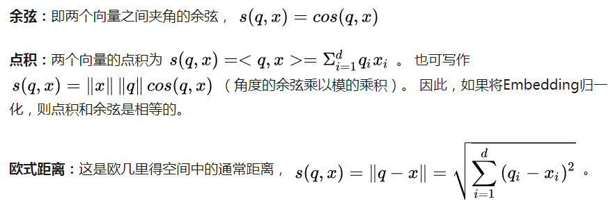
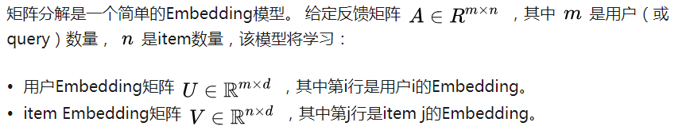
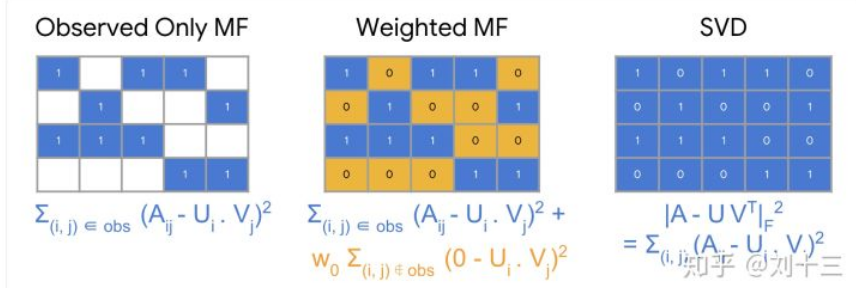

# 概述

## 一些术语：

  - 条目(Item)：推荐系统的实体。 对于淘宝来说，这些条目是用户要购买的商品。 对于抖音，这些条目是视频。
  - 查询(Query)：推荐系统用以给出推荐的相关信息，查询可以是以下各项的组合。
    - 用户信息：用户的ID，身份信息等
    - 上下文信息：一天中的时间，用户的设备等
    - 条目信息：商品名称，商品类别。
  - 嵌入(Embedding)：从离散集合（查询集或要推荐的条目）到嵌入（Embedding）空间的向量空间映射。
  
## 推荐系统架构

  - 推荐系统的一种通用体系架构由三部分组成：召回、打分、重排。
    - 召回（粗排）：系统从潜在的庞大语料库生成更小的候选集。考虑到语料库的庞大规模，该模型需要快速评估查询。给定模型可以有多个召回队列，每个召回队列都筛选出不同类型的候选子集。
    - 计分（精排）：另一个模型对候选集进行评分和排序，以选择要显示给用户的集合（大约10个）。
    - 重排（调序）：系统必须考虑最终排名的其他限制。例如，系统删除用户明确不喜欢的项目或提高时效内容的得分。重新排序还可以帮助确保多样性，时效性和公平性。
    
# 召回

## 召回概述

  - 常见的召回方法：
    - 基于内容的过滤：使用item之间的相似性来推荐与用户喜欢的item相似的item。
    - 协同过滤：同时使用query和item之间的相似性来进行推荐。
    - 基于神经网络的方法：利用神经网络生成相应的候选集。
    
## 向量空间

  - 基于内容的过滤和协同过滤都将每个item和每个query（或上下文）映射到公共Embedding空间中的Embedding向量。通常，Embedding空间是低维的（即， d比语料库的大小小得多），用以表示item或query的某些潜在含义。相似item最终在Embedding空间中拥有相近的表示。 “相似性”的概念由相似性度量定义。

## 相似性度量

  - 常用的相似性度量方法：
    - 余弦(cosine)
    - 点积(dot product)
    - 欧式距离(Euclidean distance)
    
    
    
## 基于内容的过滤
  - 根据用户先前的操作或明确的反馈(例如点击，评论等)，基于内容的过滤使用item相关特征来推荐给用户与之前喜欢的item类似的item。
  - 基于内容过滤的优点:
    - 该模型不需要其他用户的任何数据，因为推荐是针对该用户的。 这使得更容易扩展到大量用户。
    - 该模型可以捕获用户的特定兴趣，并可以推荐其他用户很少感兴趣的但该用户喜欢的item。
  - 基于内容过滤的缺点
    - 由于item的特征表示在某种程度上是手工设计的，因此该技术需要大量领域知识。 因此，模型很依赖手工设计特征的好坏。
    - 该模型只能根据用户的现有兴趣提出建议。 换句话说，该模型扩展用户现有兴趣的能力有限。
      
## 协同过滤
  - 协同过滤同时使用用户或item之间的相似性来进行推荐。 这样可以提高模型的推荐拓展性。此外，可以自动学习Embedding，而无需依赖手工设计的特征。
  - 当模型自动学习Embedding时，这种方法的协同性质就显而易见了。 假设电影的Embedding矢量是固定的。 然后，模型可以为用户学习Embedding向量，以最好地解释他们的偏好。 因此，具有相似偏好的用户的Embedding将紧密在一起。 同样，如果用户的Embedding是固定的，则我们可以学习电影Embedding以最好地解释反馈矩阵。 结果，类似用户喜欢的电影的Embedding将在Embedding空间中紧密在一起。
  - 矩阵分解
  

  - 选择目标函数
  

  - 最小化目标函数
    - 随机梯度下降(SGD)
    - 加权交替最小二乘(WALS): WALS的工作方式是随机初始化Embedding，然后在以下条件之间交替进行.
      - 固定U求解V
      - 固定V求解U

  - SGD vs. WALS
    - SGD优点:
      - 非常灵活：适用于其他损失函数。
      - 可以并行化。
    - SGD缺点:
      - 较慢：收敛速度不那么快。
      - 难以处理未观察到的项（entries），需要使用负采样或gravity。
    - WALS优点:
      - 可以并行化。
      - 收敛速度比SGD更快。
      - 更容易处理未观察到的项（entries）。
    - WALS缺点:
      - 仅适用于平方损失。

  - 协同过滤的优点和缺点
    - 优点：
      - 无需领域知识
      - 发掘用户兴趣
      - 初始模型比较容易，仅需要反馈矩阵即可训练矩阵分解模型。
    - 缺点：
      - 冷启动问题
      - 难以融入query/item的附加特征

## 深度神经网络模型

  - 深度神经网络（DNN）模型可以解决矩阵分解的这些限制。 DNN可以轻松地融入query特征和item特征（由于网络输入层的灵活性），这可以帮助捕获用户的特定兴趣并提高推荐的相关性。
  
### Softmax DNN 模型

  - 一种可能的DNN模型是利用softmax作为最后一层的输出，它会将问题视为多分类问题，其中：
    - 输入是用户query。
    - 输出是一个概率向量，其大小等于语料库中item的数量，代表与每个item进行交互的概率； 例如，点击或观看视频的可能性。
  - Softmax Embedding：
  
  - 训练数据：训练数据由query特征 [公式] 和与用户进行交互的item向量组成。
  - 负采样：
    - 负例是与给定query“无关”的item。 模型在训练过程中加入负例，可以教给该模型不同群体的Embedding应相互远离。
    - 可以使用负采样来代替使用所有item来计算梯度, 使用:
      - 所有的正例
      - 采样后的负例
      
### 矩阵分解 Vs 神经网络

  - 对于大型语料库，矩阵分解通常是更好的选择。 它更易于扩展，预测速度也更快且不易折叠。
  - DNN模型可以更好地捕获个性化属性，但更难训练且预测成本更高。
  - DNN模型在打分精准性上优于矩阵分解，因为DNN模型可以使用更多特征来更好地刻画相关性。
  - DNN模型折叠（folding）通常是可以接受的，因为通常是在假定相关的预过滤候选集上进行排名。

# 排序

## 检索

  - 在服务时，给定查询，首先要执行以下操作之一：
    - 对于矩阵分解模型，query（或user）Embedding是静态已知的，并且系统可以简单地从Embedding矩阵中查找到。
    - 对于DNN模型，系统将在服务时间内计算特征向量x通过网络后对应的Embedding。
  - 大规模检索：对于大的语料库，详尽的评分可能会很耗时，可以使用以下两种策略之一来提高其效率：
    - 如果query Embedding是静态已知的，则系统可以脱机计算详尽的评分，预先计算并存储每个query的最佳候选item列表。 这是相关item推荐的常见做法。
    - 使用近似最近邻。
    
## 排序

  - 在生成候选对象之后，另一个模型会对生成的候选对象进行打分和排序，得到最后要推送的item列表。
  - 推荐系统可能具有使用不同来源的多个召回队列，例如：
    - 矩阵分解模型的相关item。
    - 个性化的用户item。
    - “本地”与“非本地”项目；也就是说考虑地理信息。
    - 热门或流行item。
    - 社交网络；也就是朋友喜欢或推荐的item。
  - 系统将这些不同的来源组合成一个通用的候选库，然后由单个模型对其进行打分并根据该分数进行排名。
  
### 为什么不使用召回阶段的得分进行排序，而要重新计算分数？
  - 一些系统依赖多个召回队列。 这些不同召回队列的得分不具有可比性。
  - 由于候选池较小，因此系统可以负担得起更多特征和更复杂的精排模型（可以更好地捕获上下文）。
  
### 选择排序模型的目标函数

  - 常用的优化目标有以下几种：
    - 最大化点击率：如果目标函数只针对点击进行优化，则系统可能会推荐诱导用户点击的视频。 该目标函数可以提高用户点击，但不能带来良好的用户体验。 用户的兴趣可能会很快消失。
    - 延长观看时间：如果目标函数针对观看时间进行优化，则系统可能会推荐较长的视频，这可能会导致不良的用户体验。 多个短视频的观看时长和一个长视频的观看时长一样是一样的。
    - 增加多样性并最大化观看时间：推荐较短的，但更可能吸引用户的视频。
  
### 打分的位置偏差

  - 与在屏幕上方显示的item相比，在屏幕下方显示的item被点击的可能性较小。对所有可能的位置进行打分太耗时了。 即使对多个位置打分是可行的，系统仍可能无法在多个排序得分中保持一致性。
  - 解决方案：
    - 创建与位置无关的排序。
    - 对所有候选item进行排序，假设他们都在屏幕的顶部。

## 重排

  - 在推荐系统的最后阶段，系统对候选item重新排序，以考虑其他因素或约束。
  - 一种重新排序的方法是使用过滤器来删除一些候选item。
    - 示例：可以通过执行以下操作来对视频推荐结果进行重新排名：
      - 训练一个单独的模型来检测视频是否为诱惑点击的钓鱼视频。
      - 在候选集上运行此模型。
      - 在候选集中删除模型判断结果为诱惑点击的视频。
  - 另一种重排方法是转换排序阶段返回的分数。
    - 示例：系统根据以下函数修改得分来重新对视频进行排序：
      - 影片出品时间
      - 影片长度
      
## 时效性，多样性和公平性

  - 时效性：大多数推荐系统旨在融合最新的使用信息，例如当前用户历史记录和最新item。使模型保持最新状态有助于模型给出更好的推荐。
    - 解决方案：
      - 尽可能频繁地重新训练模型以学习最新的训练数据。建议使用在线学习或增量学习等相关技术，以便模型不必从头开始重新学习。增量学习可以大大减少训练时间。例如，在矩阵分解中，加载先前计算出的item Embedding进行更新计算。
      - 创建一个“平均”用户来代表矩阵分解模型中的新用户。不需要为每个用户使用相同的Embedding，可以根据用户特征对用户进行聚类。
      - 使用诸如DNN模型或双塔模型。由于该模型将特征向量作为输入，因此可以处理在训练数据中未出现的query或item。
      - 添加item时间相关信息作为特征。例如，可以将视频发布了多长时间或上次观看的时间添加为特征。
      
  - 多样性：如果系统始终推荐与query Embedding“最接近”的item，则候选item往往彼此非常相似。多样性的缺乏会导致无聊的用户体验。
    - 解决方案：
      - 使用不同的来源训练多个召回队列。
      - 使用不同的目标函数训练多个排序模型。
      - 根据类别或其他元数据对item重新排序，以确保多样性。
      
  - 公平性：模型应公平对待所有用户。 因此，请确保模型没有从训练数据中学习到无意识的偏见。
    - 解决方案：
      - 在设计和开发中融入不同的角度。
      - 在综合数据集上训练ML模型。 当数据太稀疏时，添加辅助数据。
      - 跟踪每个用户统计指标（例如，准确性和绝对误差）以观察偏差。
      - 为特定群体训练单独的模型。
  
  ### 参考资料
  
    - 链接：https://zhuanlan.zhihu.com/c_1169669630389440512
